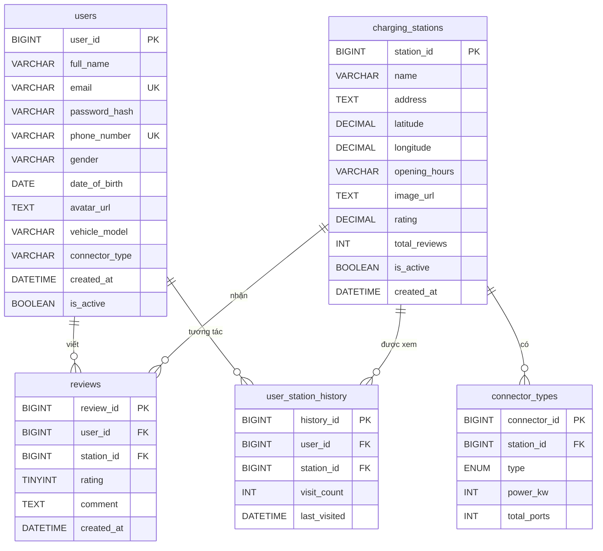

# 02 — Thiết kế cơ sở dữ liệu (Database Design)

> Tài liệu mô tả thiết kế CSDL MySQL cho hệ thống **VinFast Charging Station Finder**.
> Database: `vinfast_charging` · Charset: `utf8mb4` · Engine: `InnoDB`

---

## 1. Tổng quan

Cơ sở dữ liệu gồm **5 bảng chính**, phục vụ các chức năng: quản lý người dùng, trạm sạc, loại cổng sạc, đánh giá và lịch sử tương tác.

| # | Bảng | Mô tả |
|---|------|-------|
| 1 | `users` | Thông tin người dùng (tài khoản, xe, loại cổng sạc) |
| 2 | `charging_stations` | Thông tin trạm sạc (vị trí, giờ mở cửa, điểm đánh giá) |
| 3 | `connector_types` | Các loại cổng sạc có tại mỗi trạm |
| 4 | `reviews` | Đánh giá của người dùng cho trạm sạc |
| 5 | `user_station_history` | Lịch sử tương tác người dùng — trạm sạc |

---

## 2. Sơ đồ quan hệ (ERD)



---

## 3. Chi tiết từng bảng

### 3.1 `users` — Người dùng

| Cột | Kiểu | Ràng buộc | Mô tả |
|-----|------|-----------|-------|
| `user_id` | BIGINT | PK, AUTO_INCREMENT | Mã người dùng |
| `full_name` | VARCHAR(100) | NOT NULL | Họ tên |
| `email` | VARCHAR(100) | UNIQUE | Email cá nhân (tùy chọn) |
| `password_hash` | VARCHAR(255) | NOT NULL | Mật khẩu đã hash (bcrypt) |
| `phone_number` | VARCHAR(15) | NOT NULL, UNIQUE | Số điện thoại dùng để đăng nhập |
| `gender` | VARCHAR(10) | — | Giới tính (MALE, FEMALE, OTHER) |
| `date_of_birth` | DATE | — | Ngày sinh |
| `avatar_url` | TEXT | — | Link ảnh đại diện |
| `vehicle_model` | VARCHAR(50) | — | Model xe VinFast (VF5, VF8, VF9...) |
| `connector_type` | VARCHAR(20) | — | Loại cổng sạc ưa thích: `CCS2`, `AC`, `CHAdeMO`... |
| `created_at` | DATETIME | NOT NULL, DEFAULT NOW | Ngày tạo tài khoản |
| `is_active` | BOOLEAN | NOT NULL, DEFAULT TRUE | Trạng thái hoạt động |

### 3.2 `charging_stations` — Trạm sạc

| Cột | Kiểu | Ràng buộc | Mô tả |
|-----|------|-----------|-------|
| `station_id` | BIGINT | PK, AUTO_INCREMENT | Mã trạm |
| `name` | VARCHAR(200) | NOT NULL | Tên trạm sạc |
| `address` | TEXT | NOT NULL | Địa chỉ đầy đủ |
| `latitude` | DECIMAL(10,8) | NOT NULL | Vĩ độ |
| `longitude` | DECIMAL(11,8) | NOT NULL | Kinh độ |
| `opening_hours` | VARCHAR(100) | DEFAULT '24/7' | Giờ hoạt động |
| `image_url` | TEXT | — | Đường dẫn hình ảnh trạm |
| `rating` | DECIMAL(2,1) | DEFAULT 0.0 | Điểm trung bình (1.0–5.0) |
| `total_reviews` | INT | DEFAULT 0 | Tổng số lượt đánh giá |
| `is_active` | BOOLEAN | NOT NULL, DEFAULT TRUE | Trạng thái hoạt động |
| `created_at` | DATETIME | NOT NULL, DEFAULT NOW | Ngày tạo |

> **Index:** `idx_location (latitude, longitude)` — tối ưu truy vấn tìm trạm theo vị trí.

### 3.3 `connector_types` — Loại cổng sạc tại trạm

| Cột | Kiểu | Ràng buộc | Mô tả |
|-----|------|-----------|-------|
| `connector_id` | BIGINT | PK, AUTO_INCREMENT | Mã cổng sạc |
| `station_id` | BIGINT | FK → `charging_stations` | Trạm sở hữu |
| `type` | ENUM | NOT NULL | `AC`, `DC`, `CCS2`, `CHAdeMO`, `Type2` |
| `power_kw` | INT | NOT NULL | Công suất sạc (kW) |
| `total_ports` | INT | NOT NULL, DEFAULT 1 | Số lượng cổng sạc cùng loại |

> **ON DELETE CASCADE:** Xóa trạm → tự động xóa các connector_types liên quan.

### 3.4 `reviews` — Đánh giá

| Cột | Kiểu | Ràng buộc | Mô tả |
|-----|------|-----------|-------|
| `review_id` | BIGINT | PK, AUTO_INCREMENT | Mã đánh giá |
| `user_id` | BIGINT | FK → `users` | Người đánh giá |
| `station_id` | BIGINT | FK → `charging_stations` | Trạm được đánh giá |
| `rating` | TINYINT | NOT NULL, CHECK (1–5) | Điểm đánh giá |
| `comment` | TEXT | — | Nội dung bình luận |
| `created_at` | DATETIME | NOT NULL, DEFAULT NOW | Thời gian đánh giá |

> **Lưu ý:** Một người dùng có thể đánh giá nhiều lần cho cùng một trạm (không có UNIQUE constraint trên `user_id + station_id`).

### 3.5 `user_station_history` — Lịch sử tương tác

| Cột | Kiểu | Ràng buộc | Mô tả |
|-----|------|-----------|-------|
| `history_id` | BIGINT | PK, AUTO_INCREMENT | Mã lịch sử |
| `user_id` | BIGINT | FK → `users` | Người dùng |
| `station_id` | BIGINT | FK → `charging_stations` | Trạm tương tác |
| `visit_count` | INT | NOT NULL, DEFAULT 1 | Số lần truy cập |
| `last_visited` | DATETIME | NOT NULL, DEFAULT NOW | Lần cuối truy cập |

> **UNIQUE KEY:** `uq_user_station_hist (user_id, station_id)` — Mỗi cặp user–station chỉ có 1 bản ghi lịch sử. Khi user xem trạm lần nữa → tăng `visit_count` và cập nhật `last_visited`.

---

## 4. Ghi chú thiết kế

1. **Denormalize `rating` & `total_reviews`** trong `charging_stations` để tránh tính toán lại mỗi lần hiển thị danh sách. Backend cập nhật khi có review mới.
2. **`connector_type` trong `users`** lưu dạng chuỗi đơn giản (không FK) để linh hoạt — phục vụ lọc/gợi ý trạm phù hợp.
3. **Soft delete** thông qua cột `is_active` — không xóa vật lý bản ghi.
4. **Charset `utf8mb4`** — hỗ trợ tiếng Việt và emoji trong đánh giá.

---

## 5. Script SQL đầy đủ

```sql
-- =====================================================
-- DATABASE: VINFAST CHARGING STATION FINDER
-- =====================================================

CREATE DATABASE IF NOT EXISTS vinfast_charging
  CHARACTER SET utf8mb4
  COLLATE utf8mb4_unicode_ci;

USE vinfast_charging;

-- 1. Bảng Người dùng
CREATE TABLE users (
    user_id       BIGINT AUTO_INCREMENT PRIMARY KEY,
    full_name     VARCHAR(100)  NOT NULL,
    email         VARCHAR(100)  UNIQUE,
    password_hash VARCHAR(255)  NOT NULL,
    phone_number  VARCHAR(15)   NOT NULL UNIQUE,
    gender        VARCHAR(10),
    date_of_birth DATE,
    avatar_url    TEXT,
    vehicle_model VARCHAR(50),
    connector_type VARCHAR(20),
    created_at    DATETIME      NOT NULL DEFAULT CURRENT_TIMESTAMP,
    is_active     BOOLEAN       NOT NULL DEFAULT TRUE
) ENGINE=InnoDB DEFAULT CHARSET=utf8mb4;

-- 2. Bảng Trạm sạc
CREATE TABLE charging_stations (
    station_id    BIGINT AUTO_INCREMENT PRIMARY KEY,
    name          VARCHAR(200)   NOT NULL,
    address       TEXT           NOT NULL,
    latitude      DECIMAL(10,8)  NOT NULL,
    longitude     DECIMAL(11,8)  NOT NULL,
    opening_hours VARCHAR(100)   DEFAULT '24/7',
    image_url     TEXT,
    rating        DECIMAL(2,1)   DEFAULT 0.0,
    total_reviews INT            DEFAULT 0,
    is_active     BOOLEAN        NOT NULL DEFAULT TRUE,
    created_at    DATETIME       NOT NULL DEFAULT CURRENT_TIMESTAMP,
    INDEX idx_location (latitude, longitude)
) ENGINE=InnoDB DEFAULT CHARSET=utf8mb4;

-- 3. Bảng Loại cổng sạc tại trạm
CREATE TABLE connector_types (
    connector_id BIGINT AUTO_INCREMENT PRIMARY KEY,
    station_id   BIGINT      NOT NULL,
    type         ENUM('AC','DC','CCS2','CHAdeMO','Type2') NOT NULL,
    power_kw     INT         NOT NULL,
    total_ports  INT         NOT NULL DEFAULT 1,
    FOREIGN KEY (station_id)
        REFERENCES charging_stations(station_id)
        ON DELETE CASCADE
) ENGINE=InnoDB DEFAULT CHARSET=utf8mb4;

-- 4. Bảng Đánh giá
CREATE TABLE reviews (
    review_id  BIGINT AUTO_INCREMENT PRIMARY KEY,
    user_id    BIGINT    NOT NULL,
    station_id BIGINT    NOT NULL,
    rating     TINYINT   NOT NULL CHECK (rating BETWEEN 1 AND 5),
    comment    TEXT,
    created_at DATETIME  NOT NULL DEFAULT CURRENT_TIMESTAMP,
    FOREIGN KEY (user_id)    REFERENCES users(user_id)             ON DELETE CASCADE,
    FOREIGN KEY (station_id) REFERENCES charging_stations(station_id) ON DELETE CASCADE
) ENGINE=InnoDB DEFAULT CHARSET=utf8mb4;

-- 5. Bảng Lịch sử tương tác
CREATE TABLE user_station_history (
    history_id   BIGINT AUTO_INCREMENT PRIMARY KEY,
    user_id      BIGINT   NOT NULL,
    station_id   BIGINT   NOT NULL,
    visit_count  INT      NOT NULL DEFAULT 1,
    last_visited DATETIME NOT NULL DEFAULT CURRENT_TIMESTAMP,
    FOREIGN KEY (user_id)    REFERENCES users(user_id)             ON DELETE CASCADE,
    FOREIGN KEY (station_id) REFERENCES charging_stations(station_id) ON DELETE CASCADE,
    UNIQUE KEY uq_user_station_hist (user_id, station_id)
) ENGINE=InnoDB DEFAULT CHARSET=utf8mb4;
```
